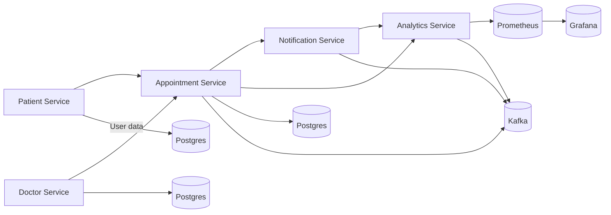

# Healthcare Appointment Scheduling System 

## 0) Overview
The **Healthcare Appointment Scheduling System** is a microservices‑based application built with **Quarkus**, designed to efficiently manage healthcare appointments while ensuring scalability, resiliency, and observability. The system allows patients to register, doctors to manage availability, appointments to be scheduled seamlessly, notifications to be dispatched automatically, and analytics to be monitored in real time.

---

## 1) Microservices Overview
The system includes **five** independently deployable services:

### 1️⃣ Patient Service
**Responsibilities:**
- Manage patient profiles: registration, personal info, contact details, medical history.
- Allow patients to view, update, and delete their information.
- Retrieve a patient’s appointment history via the Appointment Service.

**Endpoints:**
- `POST /api/patients/register` — Register new patient
- `GET /api/patients/{id}` — Get patient details
- `PUT /api/patients/{id}` — Update patient profile
- `GET /api/patients/{id}/appointments` — View appointment history

**Technologies:**
- Quarkus (RESTEasy Reactive, Panache ORM)
- PostgreSQL database
- OpenAPI for documentation
- Micrometer Prometheus metrics + Grafana visualization

---

### 2️⃣ Doctor Service
**Responsibilities:**
- Manage doctor profiles: name, specialization, experience.
- Handle availability slots (working hours, vacations).
- Provide data for Appointment Service to verify slot availability.

**Endpoints:**
- `POST /api/doctors/register` — Register doctor
- `GET /api/doctors/{id}` — Retrieve doctor profile
- `PUT /api/doctors/{id}` — Update doctor details
- `GET /api/doctors/{id}/availability` — Get available slots
- `PUT /api/doctors/{id}/availability` — Update doctor’s availability

**Technologies:**
- Quarkus RESTEasy Reactive + Hibernate ORM Panache
- PostgreSQL for persistence
- Kafka producer for emitting `DoctorAvailabilityUpdated` events
- Health check via MicroProfile Health

---

### 3️⃣ Appointment Service
**Responsibilities:**
- Schedule, reschedule, and cancel appointments between patients and doctors.
- Verify doctor availability using data from the Doctor Service.
- Persist appointment information and emit domain events for notifications and analytics.
- Integrate with external calendar APIs (Google Calendar/Outlook).

**Endpoints:**
- `POST /api/appointments` — Schedule new appointment
- `GET /api/appointments/{id}` — Retrieve appointment details
- `PUT /api/appointments/{id}` — Reschedule appointment
- `DELETE /api/appointments/{id}` — Cancel appointment

**Technologies:**
- Quarkus RESTEasy Reactive + Hibernate ORM Panache
- PostgreSQL for persistence
- Kafka (SmallRye Reactive Messaging)
- OpenAPI + Swagger UI
- Circuit breaker & retries for external calendar APIs (Fault Tolerance)

---

### 4️⃣ Notification Service
**Responsibilities:**
- Listen to Kafka topics and send appointment confirmations, reminders, and cancellation messages.
- Support multiple channels (email, SMS, push notification stubs).
- Schedule daily reminders using Quarkus Scheduler.

**Endpoints:**
- `GET /api/notifications/recent` — Retrieve recent notifications

**Technologies:**
- Quarkus Reactive Messaging (Kafka consumer)
- Quarkus Scheduler for reminders
- JavaMail or Twilio integration for email/SMS
- Micrometer Prometheus for notification metrics
- Grafana dashboard to track delivery success/failure rates

---

### 5️⃣ Analytics Service (New)
**Responsibilities:**
- Collect and process operational and business data from all services.
- Aggregate metrics such as number of appointments, cancellations, and doctor utilization.
- Provide endpoints and dashboards for analytics visualization.
- Consume Kafka topics (Appointment events) and store data for Prometheus/Grafana.

**Endpoints:**
- `GET /api/analytics/appointments/daily` — Daily appointment stats
- `GET /api/analytics/doctor/{id}` — Doctor utilization metrics
- `GET /api/analytics/system/overview` — Overall service health summary

**Technologies:**
- Quarkus RESTEasy Reactive + Micrometer metrics
- Kafka consumer for Appointment events
- Prometheus + Grafana for visualization
- Optional: Jaeger tracing integration for end‑to‑end monitoring

---

## 2) Architecture Overview
**Microservice Interaction Flow:**
1. **Patient Service** handles registration and stores user profiles.
2. **Doctor Service** provides real‑time availability data.
3. **Appointment Service** handles booking, emits `AppointmentCreated` events.
4. **Notification Service** consumes those events and sends confirmations.
5. **Analytics Service** listens to all event streams and visualizes metrics.

**C4 Diagram (High‑Level):**

---

## 3) Domain‑Driven Design (DDD)
**Bounded Contexts:**
- **Patient BC:** Registration, medical data, contact info.
- **Doctor BC:** Profiles, specialties, and slot availability.
- **Scheduling BC:** Appointment booking, rescheduling, cancellation.
- **Notification BC:** Email/SMS delivery and event triggers.
- **Analytics BC:** Data aggregation, dashboards, and service metrics.

**Domain Events:**
- `AppointmentCreated`
- `AppointmentCancelled`
- `DoctorAvailabilityUpdated`
- `NotificationSent`
- `MetricsAggregated`

**Aggregates:**
- **Patient:** profile + contact info
- **Doctor:** profile + availability slots
- **Appointment:** patientId, doctorId, startTime, status
- **Notification:** type, recipient, message, status
- **Metrics:** appointmentCount, doctorUtilization

---

## 4) Monitoring, Testing & Deployment
**Monitoring:**
- Prometheus collects metrics from all services via Micrometer.
- Grafana provides dashboards for latency, throughput, and event lag.
- Jaeger tracing captures distributed transaction spans.

**Testing:**
- `@QuarkusTest` for REST endpoints and Panache repositories.
- Testcontainers for Kafka and PostgreSQL.
- Fault tolerance & retry behavior tested under simulated downtime.

**Deployment:**
- Containerized with Docker; each service has its own image.
- Deployed via Kubernetes/Minikube for scalability and load balancing.
- CI/CD pipeline via Jenkins or GitHub Actions.

---

## 5) Technology Stack
| Category | Technology |
|-----------|-------------|
| Framework | Quarkus (RESTEasy Reactive, Panache ORM) |
| Messaging | Kafka (SmallRye Reactive Messaging) |
| Database | PostgreSQL |
| Observability | Micrometer, Prometheus, Grafana, Jaeger |
| Testing | QuarkusTest, RestAssured, Testcontainers |
| Fault Tolerance | SmallRye Fault Tolerance (Retry, Circuit Breaker) |
| API Docs | OpenAPI + Swagger UI |
| Authentication (Optional) | OIDC/JWT via Keycloak |
| Containerization | Docker / Podman |
| Orchestration | Kubernetes / Minikube |
| Scheduler | Quarkus Scheduler (for reminders) |
| Native Build (Optional) | GraalVM |

---

## 6) Reactive & Self‑Healing Demo Scenario
- **Responsiveness:** Fast API response under high traffic.
- **Resiliency:** Appointment Service retries failed DB connections; health auto‑recovers.
- **Elasticity:** Appointment and Notification Services scale horizontally under load.
- **Message‑Driven:** Kafka ensures asynchronous, decoupled service communication.
- **Self‑Healing:** Circuit breaker opens on repeated external API failures, then auto‑resets.

---

## 7) Conclusion
This five‑service architecture provides a complete, production‑grade demonstration of **microservice design principles** using **Quarkus**. It meets all required course specifications, supports reactive behavior, and provides clear monitoring, testing, and deployment workflows. The new **Analytics Service** enriches observability and performance analysis, completing a robust, end‑to‑end healthcare scheduling ecosystem.

## Contributors
- [Murad Akhundov](https://github.com/akhundMurad)
