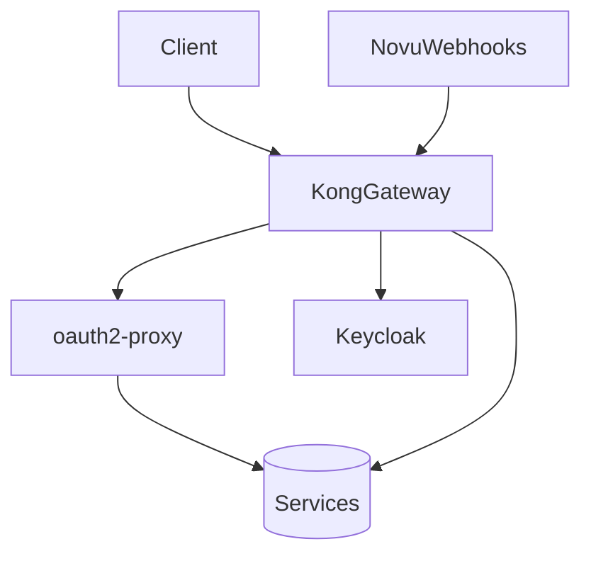

## NotificationService – API Gateway Integration Overview

### 1. Purpose

This document describes how **NotificationService** is exposed externally through a lightweight API Gateway setup using **Kong OSS**, with OAuth2/OIDC authentication handled by **Keycloak** and **oauth2-proxy**. This approach provides secure access control, basic gateway features, and minimal operational overhead suitable for a small development team.

---

### 2. High-Level Architecture

* All **user-facing API requests** to NotificationService go through:

    1. **Kong Gateway** for routing and basic policies.
    2. **oauth2-proxy** for OIDC authentication with **Keycloak**.

* **Novu callbacks/webhooks** bypass oauth2-proxy (machine-to-machine), but must be authenticated using **HMAC signatures** at Kong and verified in the service.

---

### 3. Responsibilities by Layer

| Component                       | Responsibility                                                                           |
| ------------------------------- | ---------------------------------------------------------------------------------------- |
| **Kong Gateway (OSS, DB-less)** | Routing, CORS, rate-limiting, request size limits, HMAC protection for webhooks          |
| **oauth2-proxy**                | Handles OIDC login, token exchange, and passes ID token to the service                   |
| **Keycloak**                    | Identity provider for users, issues OAuth2/OIDC tokens                                   |

---

### 4. Routing Model
> TBD
---

### 5. Authentication Approach

| Path Type                                       | Authentication Method          |
| ----------------------------------------------- | ------------------------------ |
| User-facing (`/notifications/**`)               | OAuth2/OIDC via Keycloak       |
| Novu callback (`/notifications/callbacks/novu`) | HMAC signature (shared secret) |

**Key Point:**
NotificationService still validates tokens itself using Quarkus OIDC to ensure zero trust beyond the proxy.

---

### 6. Example Configuration Summary

* **Kong**:

    * One service and route for NotificationService (protected).
    * One service and route for Novu callbacks (HMAC).
    * Plugins: CORS, rate limiting, request-size-limiting, HMAC-auth.

* **oauth2-proxy**:

    * Configured with Keycloak issuer URL, client ID/secret, and forwards the authenticated request.

* **NotificationService**:

    * Trusted only behind the gateway.
    * Validates JWT to enforce user roles/scopes.
    * Verifies HMAC signatures on webhook endpoint.

---

### 7. Why This Approach

This setup is chosen because it:

* **Minimizes operational workload** (only lightweight components, no DB for Kong).
* Uses **Keycloak for identity**, keeping auth logic consistent across all services.
* Maintains **strong security** with little configuration:

    * Auth for users (OIDC)
    * Secure machine-to-machine callbacks (HMAC)
* Avoids complexity of full enterprise API gateways while keeping a clear upgrade path.

This is suitable for a **2-developer team**, yet scalable enough to evolve later into Kong with OIDC plugin or Envoy Gateway if requirements grow.

---

### 8. Future Upgrade Options

When needed, the following evolutions are straightforward:

| Future Need                                      | Upgrade Path                                                            |
| ------------------------------------------------ | ----------------------------------------------------------------------- |
| Centralized OIDC in Kong instead of oauth2-proxy | Add Kong OIDC plugin (Enterprise or community OIDC plugin)              |
| More services, tenants, complex routing          | Split config into GitOps-managed decK manifests                         |
| Edge security policies, threat detection         | Add a WAF in front or use Cloudflare/Traefik for advanced edge features |
| Move to cloud                                    | Deploy Kong and Keycloak as managed services                            |
