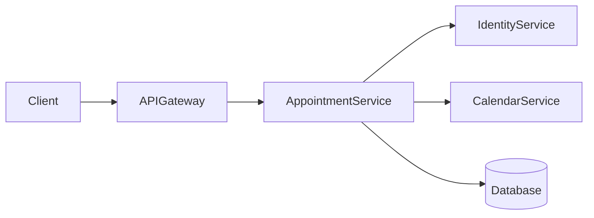

# AppointmentService

**Status:** `In Development`

**Tier / Criticality Level:** `Tier 1`

---

## Overview

The Appointment Service is responsible for (re-)scheduling and appointment cancellation between doctor and patient.

### Key Responsibilities

- Properly implement business logic of the use-cases (schedule, reschedule, and cancel appointment).
- Provide a well-documented API to trigger handling of the use-cases.
- Integrate with other services.
- Implement logging and monitoring to improve maintenance.

---

## Architecture

### High-Level Architecture Diagram



### Tech Stack

| Category      | Choice                 |
| ------------- |------------------------|
| Language      | Java                   |
| Framework     | Quark                  |
| Data Storage  | PostgreSQL or Java (?) |
| Messaging     | Kafka                  |
| Deployment    | Kubernetes             |
| Observability | Prometheus             |

---

## 🔌 APIs & Contracts

### Public Endpoints (External API)

Document only externally consumed interfaces.

| Method | Endpoint                        | Description                   | Scope                 | Rate Limit |
|--------|---------------------------------|-------------------------------|-----------------------| ---------- |
| GET    | `/appointment/participant-info` | Get participants general info | READ_PARTICIPANT_INFO | 1000/min   |
| POST   | `/appointment/schedule`         | Schedule an appoinment        | SCHEDULE_APPOINTMENT  | 1000/min   |
| PATCH  | `/appointment/reschedule`       | Re-schedule an appoinment     | SCHEDULE_APPOINTMENT  | 1000/min   |
| POST   | `/appointment/cancel`           | Cancel an appoinment          | CANCEL_APPOINTMENT    | 1000/min   |


### Internal Endpoints (Service-to-Service)

> For internal usage only

---

## 📊 Data Model

### Database Schema

> Link to schema or ERD diagram if large

### Key Entities

* `Appoinment`: brief description + link to schema
* `Participant`:

---

## 🔁 Message Contracts (If Event-Driven)
> TBD

| Topic / Queue   | Producer  | Consumer    | Schema Link |
| --------------- | --------- | ----------- | ----------- |
| `order.created` | Order-Svc | Billing-Svc | `<Schema>`  |

Include sample payloads (JSON/Avro/Protobuf).

---

## 🚀 Deployment & Environments
> TBD

| Env     | URL / Endpoint | Notes               |
| ------- | -------------- | ------------------- |
| Dev     | `<URL>`        | —                   |
| Staging | `<URL>`        | Load tests run here |
| Prod    | `<URL>`        | HA mode             |

### Deployment Process
> TBD

---

## 📈 Observability
> TBD

### Metrics

* Key business and system metrics (SLIs)

### Dashboards

* Links to Grafana/Datadog dashboards

### Alerts
> TBD

| Alert    | Condition     | Severity | Runbook          |
| -------- | ------------- | -------- | ---------------- |
| High 5xx | >5% for 5 min | High     | `<Runbook Link>` |

---

## 🛡️ Security & Compliance
> TBD

* Authentication & Authorization model
* Data sensitivity classification
* Compliance requirements (e.g., GDPR, PCI, HIPAA)
* Secrets management approach

---

## ⚙️ Scaling & Performance
> TBD

* Expected QPS / Throughput
* Latency budget (SLOs)
* Known scaling strategies (sharding, caching, autoscaling rules)

---

## 🔧 Local Development
> TBD

### Prerequisites

* Tools, language versions, env vars

### Setup Instructions

```bash
# Example
make setup
npm install
npm run start-local
```

### Testing
> TBD

* How to run unit, integration, e2e tests

---

## 🧪 Quality & Testing Strategy
> TBD

* Test types and coverage expectations
* Test data management
* Contract testing (e.g., Pact)

---

## 📚 FAQ / Common Issues
> TBD

| Question / Issue               | Resolution                 |
| ------------------------------ | -------------------------- |
| Service fails to start locally | Run `docker-compose up -d` |

---

## 🧵 Appendix
> TBD

* Link to related design docs
* Version history / Changelog
* Ownership contacts (Slack group, email)
