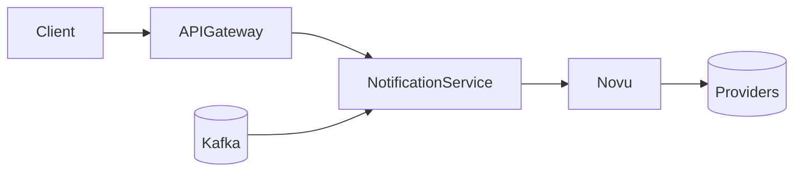

# NotificationService

- **Status**: `In Development`
- **Tier Level:** `Tier 2`

---

## Overview

The Notification Service is a dedicated system that reliably processes notification events, 
applies user preferences and routing logic, and delivers multi-channel messages 
through external providers with full tracking, retries, and auditability.

### Key Responsibilities:

* **Receive notification events** from internal services (e.g., via REST, queue, or Temporal).
* **Map events to notification templates** (select channel(s), template version, locale, and brand).
* **Manage user/subscriber data & notification preferences** (channels, frequency, categories, quiet hours).
* **Ensure reliable delivery** with idempotency, retries, backoff, and dead-letter handling.
* **Dispatch notifications to external providers** (e.g., email, SMS, push, chat, in-app) or to Novu.
* **Support multi-channel routing & fallback logic** (e.g., push → email → SMS if needed).
* **Track delivery status & handle provider callbacks/webhooks** (update logs, metrics, and state).
* **Log and store notification history** for auditing, user support, analytics, and compliance.
* **Expose APIs for querying notification status and logs**.
* **Securely manage provider credentials and configuration**.

---

## Implementation

The combination of a NotificationService with Novu ensures reliable, flexible, and compliant multi-channel notification delivery 
by keeping business logic, routing, security, 
and auditing within the service while leveraging Novu for templates, preferences, and provider integrations.

### 1) Receive notification events

**Why NotificationService + Novu fits**

* **NotificationService (NS)** exposes stable internal APIs or queues (REST endpoint or Kafka topic) so upstream systems send notification events without depending on Novu’s API format, versioning, or authentication.
* **Novu** is called only by NS, allowing you to evolve templates, providers, or workflows without touching any upstream services.

**Benefits**

* Decouples internal event schema from Novu’s contract.
* Easier migrations, testing, and backward compatibility.
* Centralized validation and idempotency at the boundary.

---

### 2) Map events to templates (channels, versions, locale, brand)

**Why NotificationService + Novu fits**

* **NS** owns business logic: converting domain events (e.g., `order.shipped`) into template selections, supported channels, brand context, locale, and A/B rules.
* **Novu** stores and renders the templates, with UI-based editing, versioning, and multi-language variants so non-engineers can update templates safely.

**Benefits**

* Business mapping remains internal and stable.
* Template updates don’t require redeploys of NS or upstream services.
* Localization and branding are easier to evolve.

---

### 3) Manage subscriber data & preferences (quiet hours, categories)

**Why NotificationService + Novu fits**

* **NS** enforces company-level rules, legal constraints, and domain-specific overrides (e.g., “critical security alerts ignore mute settings”).
* **Novu** handles standard user notification preferences, opt-ins/outs, categories, and channel settings, removing the need to build a preference center yourself.

**Benefits**

* Clear separation: NS handles compliance, Novu handles user choices.
* Flexible for multi-tenant or multi-brand systems.
* Avoids duplicating preference logic across services.

---

### 4) Ensure reliable delivery (idempotency, retries, DLQ)

**Why NotificationService + Novu fits**

* **NS** guarantees reliable processing using idempotency keys, outbox pattern, short retries, and DLQ storage for unresolved cases.
* **Novu** provides message-level deduplication (`transactionId`), channel retries, and error feedback from providers.

**Benefits**

* Delivery becomes **guaranteed exactly once** from producer perspective, even if Novu or the provider flickers.
* Failures are captured and recoverable, not lost.

---

### 5) Dispatch notifications to external providers (email, SMS, push, chat, in-app)

**Why NotificationService + Novu fits**

* **NS** decides which channels to use per event or tenant, ensuring provider-agnostic routing policies.
* **Novu** integrates with providers (SendGrid, SES, Twilio, Firebase, Slack, etc.) so NS doesn’t need to maintain dozens of SDK clients or handle provider differences.

**Benefits**

* Swapping or adding providers becomes low effort.
* NS remains clean and channel-agnostic.

---

### 6) Multi-channel routing & fallback (e.g., push → email → SMS)

**Why NotificationService + Novu fits**

* **NS** defines escalation logic, thresholds, timing windows, and fallbacks (e.g., “if push not opened in 2 minutes, send email”).
* **Novu** executes sends and returns delivery outcomes so NS can trigger the next action only when necessary.

**Benefits**

* Intelligent, policy-driven routing without hardcoding provider logic.
* Adaptable escalation strategies per product, tenant, or event type.

---

### 7) Track delivery status & handle provider callbacks

**Why NotificationService + Novu fits**

* **Novu** normalizes provider callbacks (delivered, bounced, opened, clicked, spam, failed) and exposes them via webhooks.
* **NS** receives callbacks, correlates them with business events and idempotency keys, updates logs, and emits internal metrics.

**Benefits**

* A single, clean event log that links technical status to business context.
* Enables analytics, SLAs, and support tooling.

---

### 8) Log and store notification history (audit, compliance, analytics)

**Why NotificationService + Novu fits**

* **NS** stores authoritative notification history with business identifiers, tenant context, and correlation IDs required for GDPR/DSAR and compliance.
* **Novu** provides rich delivery telemetry you can enrich and mirror into NS logs.

**Benefits**

* Internal audit trail remains vendor-independent.
* Supports customer support, regulatory audits, and BI dashboards.

---

### 9) Expose APIs for querying notification status and logs

**Why NotificationService + Novu fits**

* **NS** exposes domain-friendly queries (e.g., fetch by user, order, time range) so product teams and internal tools can view status and timelines.
* **Novu** offers message-specific debugging views and APIs for deeper technical inspection.

**Benefits**

* Operators and product teams get the views they need, in language they understand.
* Reduces support time and improves transparency.

---

### 10) Securely manage provider credentials and configuration

**Why NotificationService + Novu fits**

* **NS** centralizes secure handling of secrets, key rotation, encryption, and tenant-level configuration (Vault/KMS), keeping secrets out of business services.
* **Novu** stores provider-specific credentials scoped to its connectors, reducing exposure and making provider setup consistent across environments.

**Benefits**

* Clear security boundaries and lower blast radius.
* Credentials never leak into upstream code or workflows.
