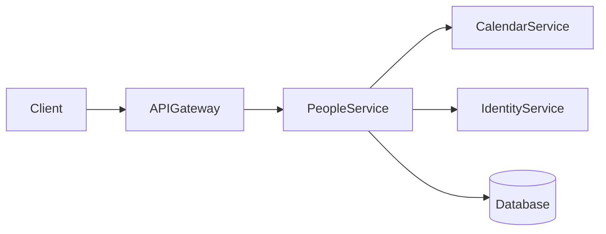
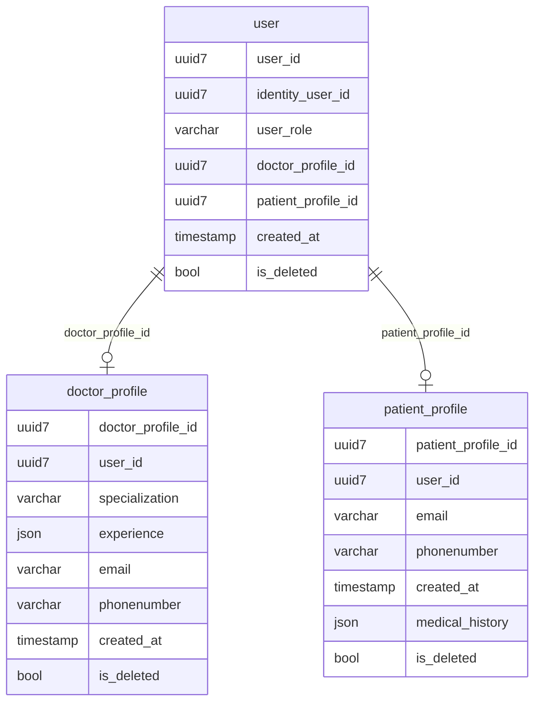

# PeopleService

**Status:** `In Development`

**Tier / Criticality Level:** `Tier 1`

---

## Overview

The People Service provides an API to manage doctors and patients and their profiles

### Key Responsibilities

- Manage patient profiles: registration, personal info, contact details, medical history.
- Allow patients to view, update, and delete their information.
- Retrieve a patient’s appointment history via the Appointment Service.
- Manage doctor profiles: name, specialization, experience.
- Handle availability slots (working hours, vacations).
- Provide data for Appointment Service to verify slot availability.

---

## Architecture

### High-Level Architecture Diagram



### Tech Stack

| Category      | Choice       |
| ------------- |--------------|
| Language      | Java         |
| Framework     | Quark        |
| Data Storage  | PostgreSQL   |
| Messaging     | Kafka        |
| Deployment    | Kubernetes   |
| Observability | Prometheus   |

---

## 🔌 APIs & Contracts

### Public Endpoints (External API)

Document only externally consumed interfaces.

| Method | Endpoint                   | Description                                 | Scope                    | Rate Limit |
|--------|----------------------------|---------------------------------------------|--------------------------|------------|
| GET    | `/people/doctors/{id}`     | Retrieve doctor's profile                   | READ_DOCTOR_PROFILE      | 1000/min   |
| PATCH  | `/people/doctors/{id}`     | Update doctor's profile                     | UPDATE_DOCTOR_PROFILE    | 1000/min   |
| POST   | `/people/doctors/register` | Register a doctor profile                   | REGISTER_DOCTOR_PROFILE  | 1000/min   |
| GET    | `/people/patient/{id}`     | Retrieve patient's profile                  | READ_PATIENT_PROFILE     | 1000/min   |
| PATCH  | `/people/patient/{id}`     | Update patient's profile                    | UPDATE_PATIENT_PROFILE   | 1000/min   |
| POST   | `/people/patient/register` | Register a patient profile                  | REGISTER_PATIENT_PROFILE | 1000/min   |


### Internal Endpoints (Service-to-Service)

> For internal usage only

empty

---

## 📊 Data Model

### Database Schema



---

## 🔁 Message Contracts (If Event-Driven)
> TBD

| Topic / Queue | Producer | Consumer | Schema Link |
|---------------|----------|----------| ----------- |
| ...           | ...      | ...      | `<Schema>`  |

---

### Deployment Process
> TBD

---

## 📈 Observability
> TBD

### Metrics
> TBD

* Key business and system metrics (SLIs)

### Dashboards
> TBD

* Links to Grafana/Datadog dashboards

### Alerts
> TBD

| Alert    | Condition     | Severity | Runbook          |
| -------- | ------------- | -------- | ---------------- |
| High 5xx | >5% for 5 min | High     | `<Runbook Link>` |

---

## 🛡️ Security & Compliance
> TBD

* Authentication & Authorization model
* Data sensitivity classification
* Compliance requirements (e.g., GDPR, PCI, HIPAA)
* Secrets management approach

---

## ⚙️ Scaling & Performance
> TBD

* Expected QPS / Throughput
* Latency budget (SLOs)
* Known scaling strategies (sharding, caching, autoscaling rules)

---

## 🔧 Local Development
> TBD

### Prerequisites

* Tools, language versions, env vars

### Setup Instructions
> TBD

```bash
# Example
make setup
npm install
npm run start-local
```

### Testing
> TBD

* How to run unit, integration, e2e tests

---

## 🧪 Quality & Testing Strategy
> TBD

* Test types and coverage expectations
* Test data management
* Contract testing (e.g., Pact)
