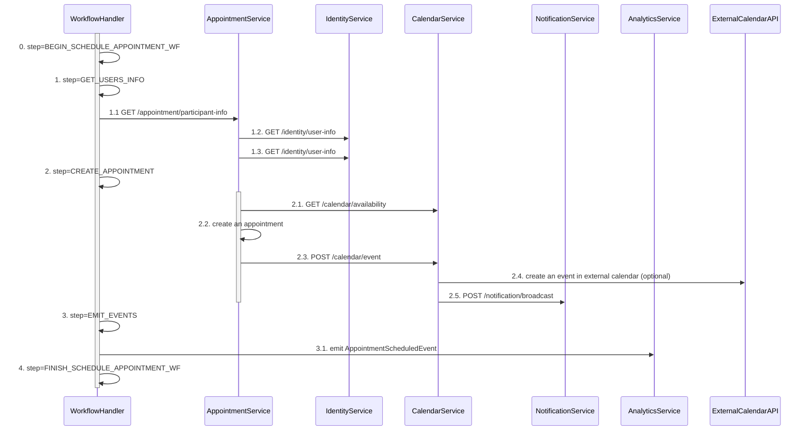
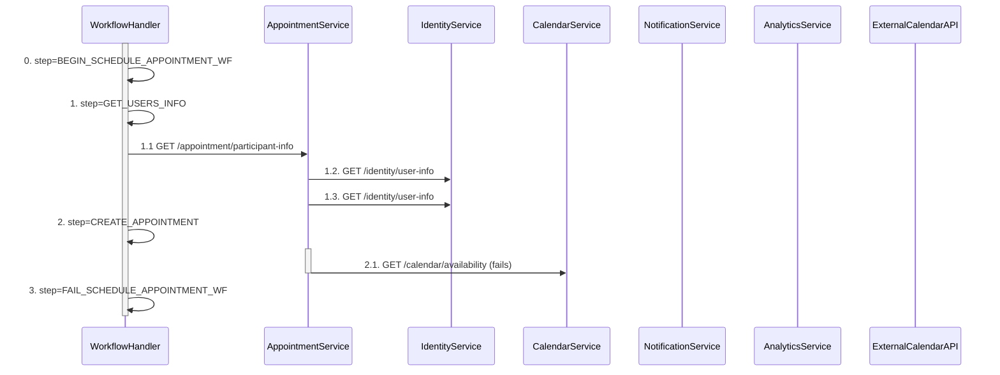

# AppointmentService use-cases documentation

This service handles the following use cases:

- Schedule appointment
- Reschedule appointment
- Cancel appointment

## Schedule appointment

### Happy scenario

1. **step=GET_USERS_INFO** get patient and doctor's general user info.

    1.1. `GET /appointment/participant-info?participantId=patientId&participantId=doctorId`

    1.2. `GET /identity/user-info?userId=patientId`

    1.3. `GET /identity/user-info?userId=doctorId`

2. **step=CREATE_APPOINTMENT** validates availability of participants before creating an appointment and event in the calendar.

    2.1. `GET /calendar/availability?participantId=patientId&participantId=doctorId&startTime=timestamp1&endTime=timestamp2`

    2.2. Creates an appointment row in the database. 

    2.3. Creates an event in the internal calendar with given parameters. 

    2.4. optional step -- sends request to external calendar (Google Calendar/Outlook) to create an event.

    2.5. `POST /notification/broadcast?recieverId=patientId&recieverId=doctorId&notification=APPOINTMENT_SCHEDULED` broadcast a notification to patient and doctor.

3. **step=EMIT_EVENTS** notify the analytics service about a new appointment (might execute ETL in the background).

**Requirements:**

- Entire use case is handled in the background.
- Steps 1-2 must have transactional behavior.
- Graceful shutdown should be implemented.
- We should have an endpoint to get process status.
- Proper logging and metrics must be implemented.

### Failure scenario

Suppose patient/doctor doesn't have available slot.

**Requirements:**

- Appointment should not be created.
- Transaction should be aborted.
- User should be notified about the issue.
