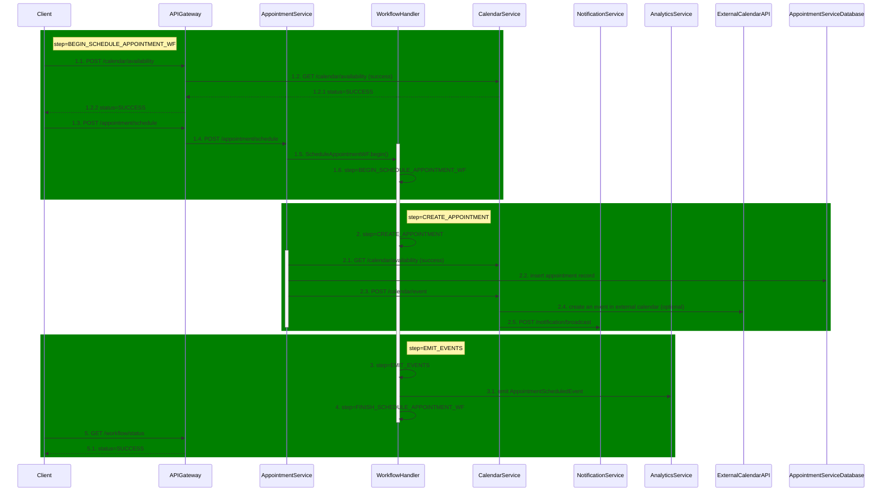
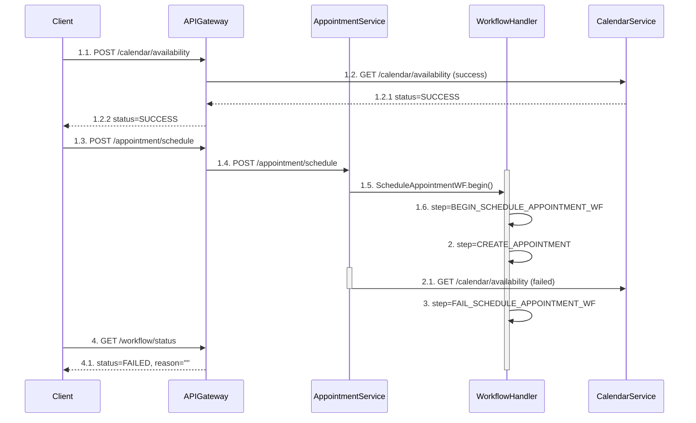
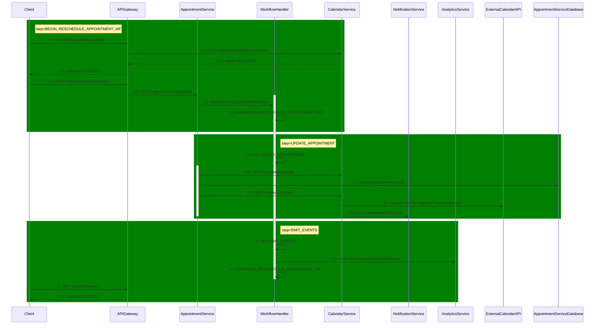
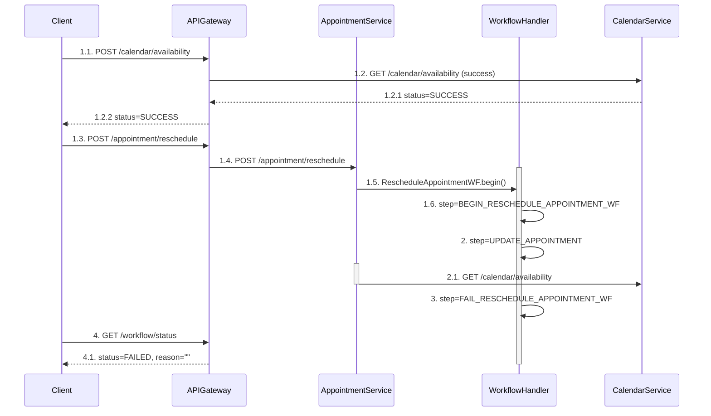
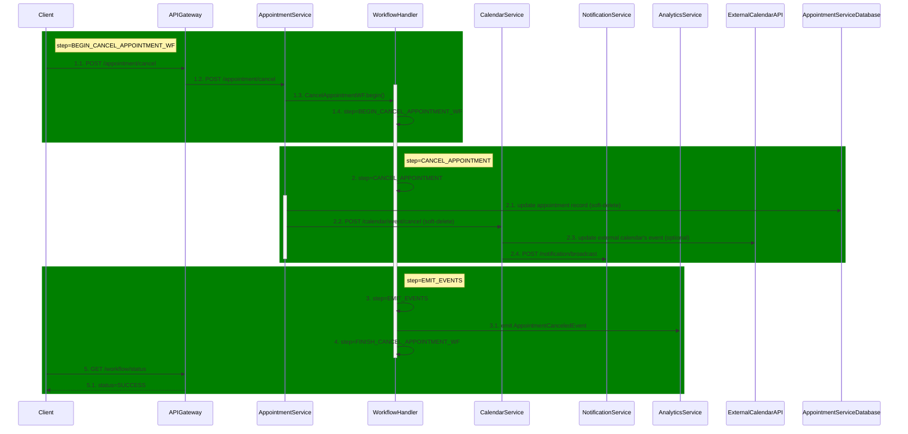

# AppointmentService use-cases documentation

This service handles the following use cases:

- Schedule appointment
- Reschedule appointment
- Cancel appointment

---

## Schedule appointment

### Happy scenario

1. **step=BEGIN_SCHEDULE_APPOINTMENT_WF** start workflow and pass necessary input parameters

2. **step=CREATE_APPOINTMENT** validates availability of participants before creating an appointment and event in the calendar.

    2.1. `GET /calendar/availability?participantId=patientId&participantId=doctorId&startTime=timestamp1&endTime=timestamp2` -- check availability of doctor and patient, fail if there's an issue.

    2.2. Create a row in the database if validation passed.

    2.3. Creates an event in the internal calendar with given parameters. 

    2.4. optional step -- sends request to external calendar (Google Calendar/Outlook) to create an event.

    2.5. `POST /notification/broadcast?recieverId=patientId&recieverId=doctorId&notification=APPOINTMENT_SCHEDULED` broadcast a notification to patient and doctor.

3. **step=EMIT_EVENTS** notify the analytics service about a new appointment (might execute ETL in the background).

**Requirements:**

- Entire use case is handled in the background.
- Steps 1-2 must have transactional behavior.
- Graceful shutdown should be implemented.
- We should have an endpoint to get process status.
- Proper logging and metrics must be implemented.

### Failure scenario

Suppose participant's time slot has been reserved after client made validation.

**Requirements:**

- Appointment should not be created.
- Transaction should be aborted.
- User should be notified about the issue.

---

## Re-schedule appointment

### Happy scenario

1. **step=BEGIN_RESCHEDULE_APPOINTMENT_WF** start workflow and pass necessary input parameters

2. **step=UPDATE_APPOINTMENT** validates availability of participants before updating an appointment and event in the calendar.

   2.1. `GET /calendar/availability?participantId=patientId&participantId=doctorId&startTime=timestamp1&endTime=timestamp2` -- check availability of doctor and patient, fail if there's an issue.

   2.2. Update a row in the database if validation passed.

   2.3. Update an event in the internal calendar with given parameters.

   2.4. optional step -- sends request to external calendar (Google Calendar/Outlook) to update an event.

   2.5. `POST /notification/broadcast?recieverId=patientId&recieverId=doctorId&notification=APPOINTMENT_RESCHEDULED` broadcast a notification to patient and doctor.

3. **step=EMIT_EVENTS** notify the analytics service about an updated appointment (might execute ETL in the background).

**Requirements:**

- Entire use case is handled in the background.
- Steps 1-2 must have transactional behavior.
- Graceful shutdown should be implemented.
- We should have an endpoint to get process status.
- Proper logging and metrics must be implemented.

### Failure scenario

Suppose participant's time slot has been reserved after client made validation.

**Requirements:**

- Appointment should not be created.
- Transaction should be aborted.
- User should be notified about the issue.

---

## Cancel appointment

### Happy scenario

1. **step=BEGIN_CANCEL_APPOINTMENT_WF** start workflow and pass necessary input parameters

2. **step=CANCEL_APPOINTMENT** soft-deletes appointment + calendar event and updates external calendar's event
   2.1. Update a row in the database (is_deleted=false).

   2.3. Update an event in the internal calendar with given parameters (is_deleted=false).

   2.4. optional step -- sends request to external calendar (Google Calendar/Outlook) to cancel an event.

   2.5. `POST /notification/broadcast?recieverId=patientId&recieverId=doctorId&notification=APPOINTMENT_CANCELED` broadcast a notification to patient and doctor.

3. **step=EMIT_EVENTS** notify the analytics service about a cancelled appointment (might execute ETL in the background).

**Requirements:**

- Entire use case is handled in the background.
- Steps 1-2 must have transactional behavior.
- Graceful shutdown should be implemented.
- We should have an endpoint to get process status.
- Proper logging and metrics must be implemented.

